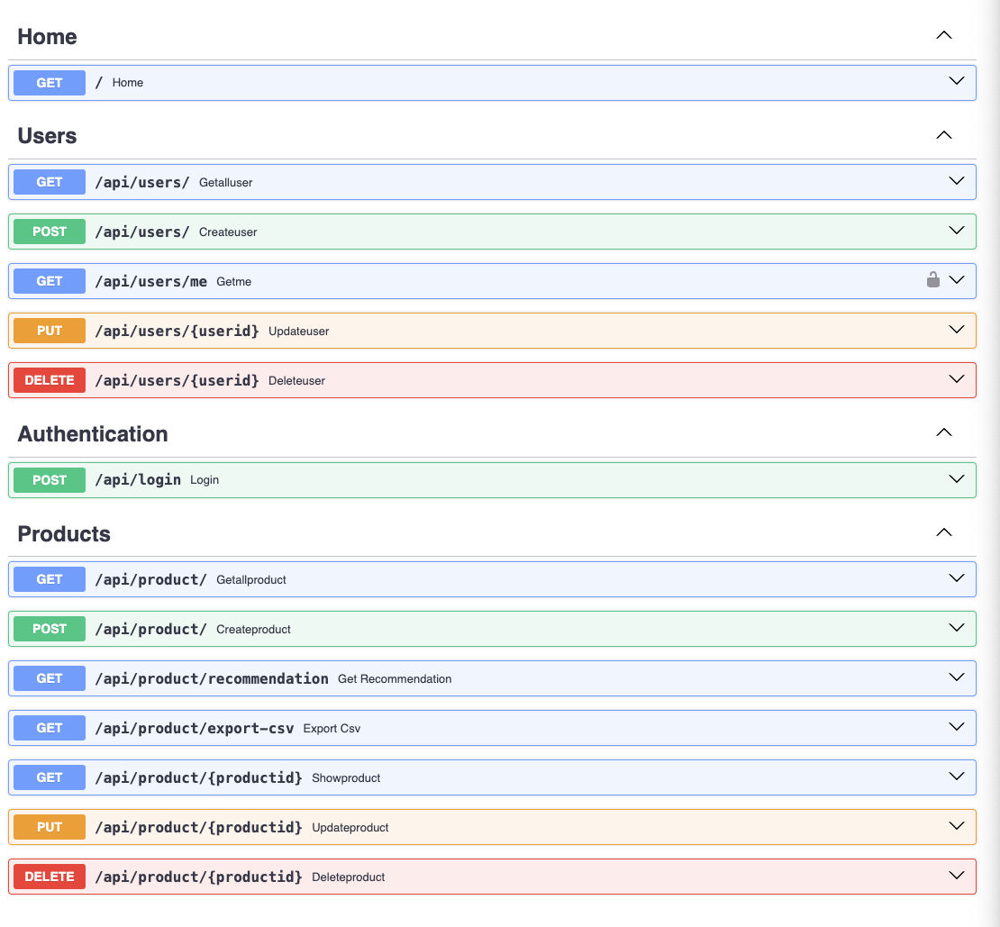

# Acleda Digital Map
> Digital map for future digital banking

# **Interactive API documentation**

### Project Overview

Project Overview:

### Project Components:

- API Component: This component is responsible for providing the back-end functionality of the application. It includes server-side logic, database interactions, and API endpoints. By housing it within the Monoripo monorepo, developers can work on it independently, allowing for modular development and testing.

- Mobile Component: The mobile UI component represents the user-facing part of the application. It includes all the front-end code, and any necessary client-side libraries or frameworks. Just like the API component, it is housed within the monorepo, enabling developers to manage the front-end and back-end codebase together seamlessly.

### Installation Guide
#### You need to install Python3.10 and Docker with Docker Compose.
Once you have installed the above and have cloned the repository, you can follow the following steps to get the project up and running:
1. Run `cd backend`
2. Run `docker-compose build`
3. Run `docker-compose up`
4.

#### How to start the app without Docker 
1. Create virtual env: `python -m venv env`
2. Activate env: `source venv/bin/activate`  # for mac & linux & window(Gitbash)
3. Activate env: `venv\Script\activate`     # for window(CMD)
4. Go to backend dir: `cd backend`
5. Install libraries: `pip install -r requirements.txt`
6. Import Dummy Data to DB: `python seed.py`
6. Start server: `python main.py`

### Backend Features

* Programming Language: Python = 3.10
* Backend Framwork: FastAPI
* Database: Postgres
* ORM: Sqlalchemy2.0 & Alembic
* Data Validation & Serialization: Pydantic
* Authentication: JWT
* Unit Test: Pytest
* API Docs: Swagger UI

